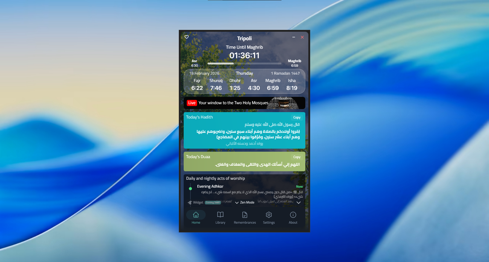
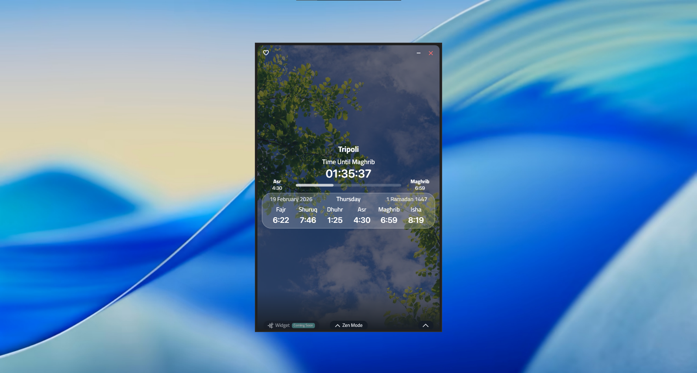
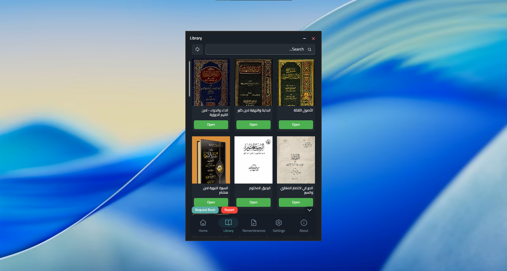
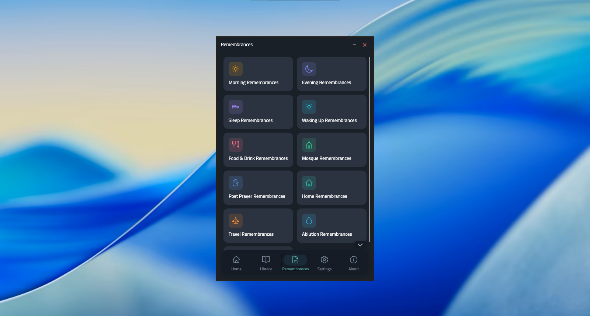
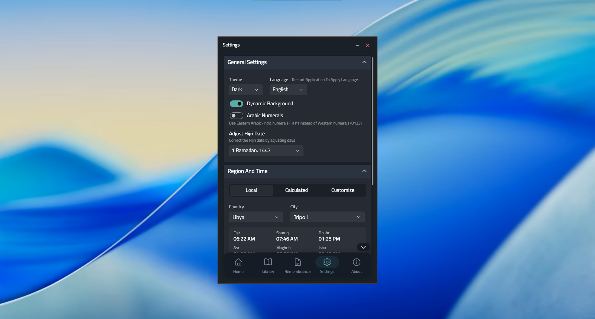
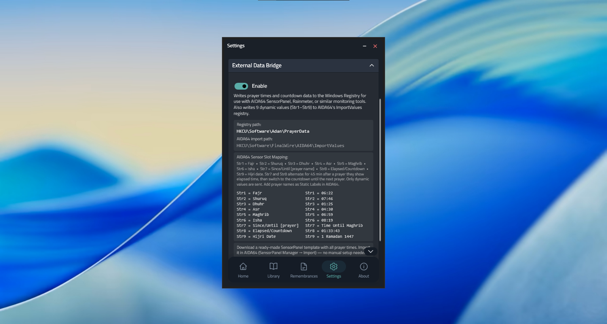
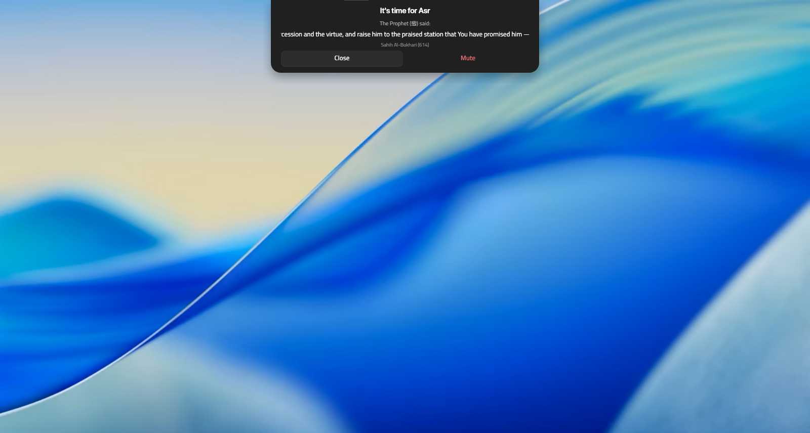

  <h1>🕌 Adan (أذان) - Windows Prayer Times App</h1>
  
<b>Your comprehensive Islamic desktop companion — keeps you connected to your daily worship.</b>

  
<b>رفيقك الإسلامي الشامل على سطح المكتب — يُبقيك متصلاً بعباداتك اليومية.</b>

  
  
    
  
  
  
  

---

  <h3> English | <a href="#-arabic-عربي">العربية</a> </h3>

## 🕌 About Adan

**Adan** is a beautifully designed, modern Windows application that provides accurate prayer times, full Adhan audio notifications, daily Hadith & Duaa, categorized Adhkar (remembrances), an Islamic book library, live Haramain broadcasts, and much more. It features a stunning Fluent UI with dynamic backgrounds that change throughout the day.

## ✨ Key Features

*   **Three Prayer Time Modes:**
    *   **Local Database:** Built-in reliable local prayer times for several Arab countries.
    *   **Astronomical Calculation:** Offline calculation based on 11 global methods (Umm Al-Qura, Egyptian, MWL, etc.) with Madhab and high-latitude adjustments.
    *   **Custom Times:** Fully customize and manually edit the prayer times to match your local mosque.
*   **Customizable Adhan:** Full Adhan audio playback. Choose from renowned Muazzins or add your own custom audio files.
*   **Daily Hadith & Duaa:** A new inspiration every day directly on your home screen.
*   **Categorized Adhkar:** 11 categories of Adhkar perfectly organized for easy reading.
*   **Islamic Library:** Read and download Islamic books directly within the app.
*   **Live Haramain Broadcast:** Watch Makkah and Madinah streams live.
*   **Beautiful UI:** Fluent design, Light/Dark themes, Zen Mode, and dynamic time-based backgrounds.
*   **Advanced Tools:** Seamless **AIDA64 SensorPanel** and Rainmeter integration for monitoring. [Download templates here](https://github.com/3sluz/AdanTimesforAIDA64).

## 📸 Screenshots

  
  

  
  

  
  

  

## 📥 Download & Installation

Download the app directly and securely from the Microsoft Store:

*Completely free. No ads. Forever.*

---

## 🕌 عن تطبيق أذان (عربي)

تطبيق **أذان** هو رفيقك الإسلامي الشامل على سطح المكتب لنظام ويندوز. صُمم بواجهة عصرية وأنيقة ليوفر لك مواقيت صلاة دقيقة، إشعارات الأذان الصوتية الكاملة، حديث ودعاء اليوم، الأذكار المصنفة، مكتبة كتب إسلامية، بث مباشر من الحرمين الشريفين، وتتبع للمناسبات الإسلامية، والكثير غير ذلك لتبقى دائمًا على اتصال بعباداتك.

## ✨ أبرز المميزات

*   **ثلاثة أنظمة لمواقيت الصلاة:**
    *   **قاعدة بيانات محلية:** مواقيت صلاة دقيقة وموثوقة لعدة دول عربية مبنية على المصادر الرسمية.
    *   **الحساب الفلكي:** أوقات الصلاة فلكياً لدعم أي موقع في العالم (11 طريقة حسابية مثل أم القرى والمساحة المصرية).
    *   **أوقات مخصصة:** إمكانية تعديل وتخصيص أوقات الصلاة يدوياً لتطابق مسجدك المحلي.
*   **أذان مخصص وتنبيهات:** أصوات الأذان لأشهر المؤذنين، مع إمكانية إضافة وتخصيص المؤذن الذي تريده بملفات صوتية.
*   **حديث ودعاء اليوم:** بطاقات متجددة يومياً على الصفحة الرئيسية.
*   **الأذكار:** 11 فئة للأذكار المتنوعة بتصميم يسهل القراءة.
*   **المكتبة الإسلامية:** تصفح وتحميل الكتب الإسلامية لقراءتها مباشرة داخل التطبيق.
*   **بث مباشر من الحرمين:** مشاهدة مستمرة للمسجد الحرام والمسجد النبوي.
*   **تصميم أنيق:** واجهة عصرية تدعم المظهر الفاتح والداكن، وضع التركيز (Zen Mode)، وخلفيات ديناميكية.
*   **ميزات متقدمة:** دعم متكامل لتصدير مواقيت الصلاة عبر **AIDA64 SensorPanel** و Rainmeter. [اقرأ التوثيق وحمّل القوالب من هنا](https://github.com/3sluz/AdanTimesforAIDA64).

## 📸 لقطات من التطبيق

  
  

  
  

  
  

  

## 📥 التحميل والتثبيت

يمكنك تحميل وتثبيت التطبيق بسهولة ومجانًا من متجر مايكروسوفت (Microsoft Store):

*التطبيق مجاني تماماً. بدون إعلانات. وسيبقى كذلك دائماً بإذن الله.*

---

  
© 2026 Mohey Eldin Asluz. All rights reserved.

